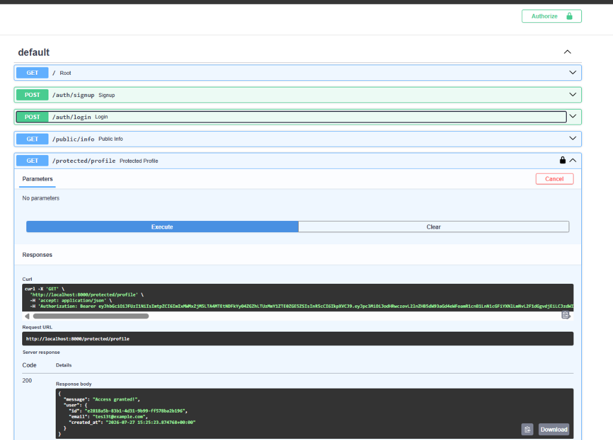
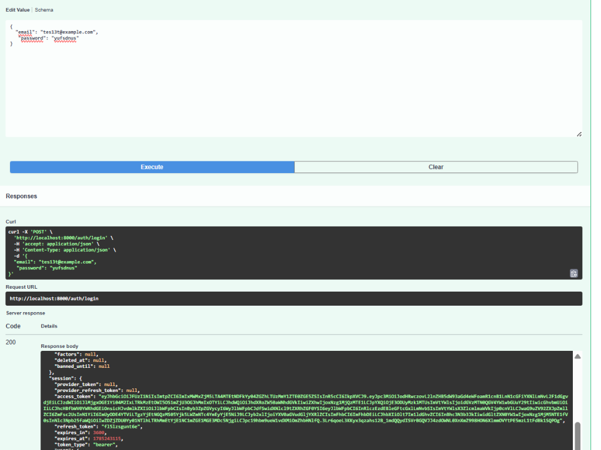

# FastAPI Supabase Auth API

A lightweight, production-ready RESTful Authentication API built with **FastAPI** and integrated with **Supabase Auth**. This project provides secure user signup, authentication, token verification via HTTP Bearer scheme, and role-separated route protection.

---

## 🚀 Features

- **User Authentication**: Register new users and log in using email and password powered by Supabase.
- **Bearer Token Security**: Custom FastAPI dependency (`check_token`) validating JWT tokens against Supabase Auth.
- **Protected & Public Endpoints**: Clean separation between public access routes and token-guarded routes.
- **Interactive Documentation**: Auto-generated interactive API docs via Swagger UI and ReDoc.

---

## 🛠️ Tech Stack

- **Framework**: [FastAPI](https://fastapi.tiangolo.com/)
- **Backend / Auth Provider**: [Supabase](https://supabase.com/)
- **Validation**: [Pydantic](https://docs.pydantic.dev/)
- **ASGI Server**: [Uvicorn](https://www.uvicorn.org/)
- **Environment Management**: `python-dotenv`

---

## ⚙️ Environment Variables Setup

Before running the application, configure your local environment variables.

1. Copy the example environment file:
   ```bash
   cp .env.example .env
   ```

2. Open `.env` and fill in your Supabase project credentials:
   ```env
   SUPABASE_URL=https://your-project-ref.supabase.co
   SUPABASE_KEY=your-supabase-anon-key
   PORT=8000
   ```

> **Note**: You can retrieve your `SUPABASE_URL` and `SUPABASE_KEY` (anon public key) from your **Supabase Dashboard** under `Project Settings > API`.

---

## 🏃 How to Run

### Prerequisites
- Python 3.10 or higher
- A Supabase account and active project

### 1. Clone the Repository
```bash
git clone https://github.com/yunuse1/Auth.git
cd Auth
```

### 2. Create and Activate Virtual Environment

**On Windows (PowerShell):**
```powershell
python -m venv venv
.\venv\Scripts\Activate.ps1
```

**On macOS/Linux:**
```bash
python3 -m venv venv
source venv/bin/activate
```

### 3. Install Dependencies
```bash
pip install -r requirements.txt
```

### 4. Start the Application

You can start the development server using either the `fastapi` CLI or `uvicorn`:

Using FastAPI CLI:
```bash
fastapi dev
```

Using Uvicorn directly:
```bash
uvicorn main:app --reload --port 8000
```

The server will start running at `http://localhost:8000`.

---

## 📑 API Reference

| HTTP Method | Endpoint | Description | Auth Required |
| :--- | :--- | :--- | :---: |
| `GET` | `/` | Root endpoint returning a welcome message | ❌ No |
| `POST` | `/auth/signup` | Registers a new user with email and password | ❌ No |
| `POST` | `/auth/login` | Authenticates credentials and returns Supabase JWT tokens | ❌ No |
| `POST` | `/auth/logout` | Signs out the current user session | ✅ Yes (Bearer Token) |
| `GET` | `/public/info` | Public informational endpoint | ❌ No |
| `GET` | `/protected/profile` | Fetches profile information for the authenticated user | ✅ Yes (Bearer Token) |
| `GET` | `/protected/dashboard` | Returns user stats for the authenticated session | ✅ Yes (Bearer Token) |

---

## 📸 Swagger UI Screenshots

Once the server is running, access the interactive API documentation at:
👉 **[http://localhost:8000/docs](http://localhost:8000/docs)**

### 1. Authenticated Profile Endpoint Execution (`GET /protected/profile`)
Using the **Authorize** button in Swagger UI to attach the `Bearer <access_token>` allows access to protected resources.



### 2. User Authentication Response (`POST /auth/login`)
Executing the `/auth/login` endpoint returns the session tokens (`access_token`, `refresh_token`) and user metadata from Supabase.



---

## 🤖 AI vs Me (AI Rematch Analysis)

In this stage, a complete prompt was provided to ChatGPT to build the exact same FastAPI + Supabase Auth API from scratch. Below is the comparative analysis between my hand-built implementation and the AI-generated code.

---

### 1. What the AI Did Better / Structural Decisions
- **Chained Dependency Granularity:** The AI separated token extraction (`get_access_token`) and user verification (`get_current_user`) into two separate dependencies. This modular approach makes token extraction reusable for routes that only require the raw JWT string without making an active network call to Supabase.
- **Explicit Input Trimming:** AI created a dedicated helper function (`validate_auth_input`) that explicitly checked for whitespace-only inputs (`email.strip()` / `password.strip()`), providing immediate `400 Bad Request` responses before attempting a network request to Supabase.

---

### 2. What the AI Got Wrong or Introduced (Bugs & Security Flaws)
- **Inconsistent Error Response Schemas:**
  - **Hand-built Version:** I implemented a custom `HTTPException` handler in `main.py` that intercepts all errors and forces them into a clean JSON contract: `{"error": "message"}`.
  - **AI Version:** The AI passed raw dictionaries into `HTTPException(detail={"error": "..."})` for some routes, while using plain strings (`detail="Invalid credentials."`) for others. This resulted in nested/inconsistent FastAPI default responses like `{"detail": {"error": "..."}}` or `{"detail": "..."}`, breaking API response format expectations.
- **Lack of Email Format Validation:** The AI used a basic `str` for the email field inside `AuthRequest` instead of Pydantic’s `EmailStr`. As a result, malformed emails (e.g., `"notanemail"`) were sent directly to Supabase rather than being rejected at the API boundary layer.
- **Unnecessary Parameter Dependency in Logout:** In `POST /auth/logout`, the AI required `token: str = Depends(get_access_token)` as an explicit function parameter. In my implementation, route-level protection was cleanly enforced using decorator dependencies (`dependencies=[Depends(get_current_user)]`), preventing unused parameters in the endpoint definition.

---

### 3. What the Prompt Missed & Silent AI Decisions
- **Prompt Omissions:** The prompt did not explicitly specify the exact JSON key name for error responses (`error` vs `detail`) or require modular folder organization (`models/user_credentials.py`).
- **AI Assumptions:** The AI assumed a single-file flat architecture, placed all Pydantic models directly inside `main.py`, and defaulted to FastAPI’s standard exception wrapping behavior.